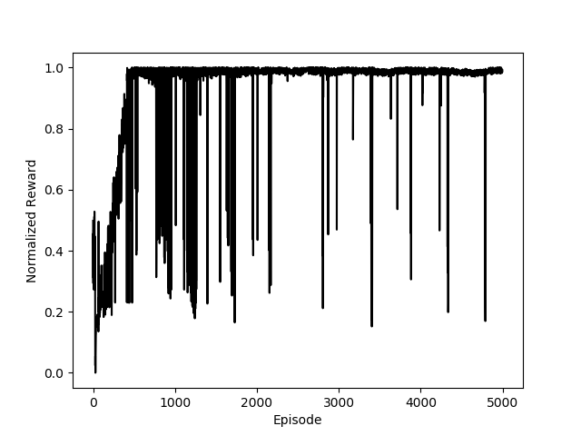

# Reinforcement Learning 

## Deep Q-Learning

### Homework

## Deep Deterministic Policy Gradient
DDPG implement DPG algorithm with actor-critic parametrized with neural networks.\\

### Actor ###
Actor estimate policy  which maps from state to action.\\ 

### Critic ###
Critic estimate action value function  under policy .\\

### Homework

  
  \item \textbf{(Optional)} In continous montain car is 
  

 
  Penalize velocity in mountain car and compare.
\end{itemize}

### My results

